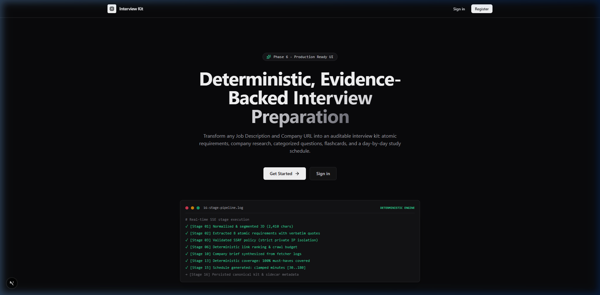
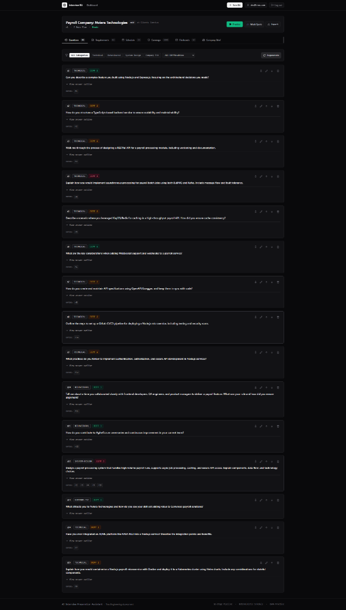
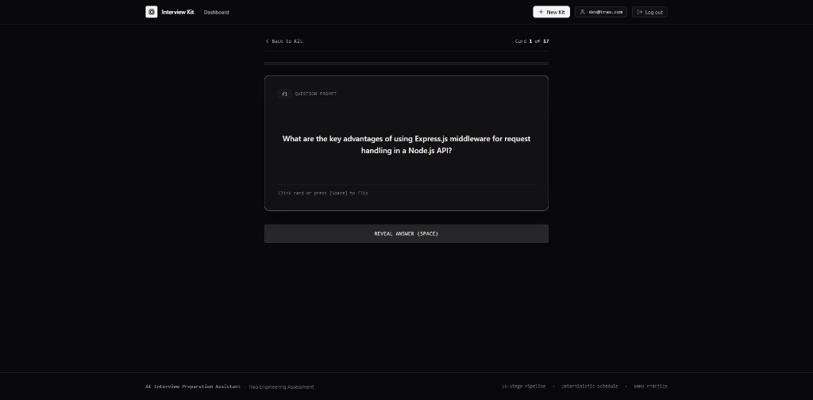
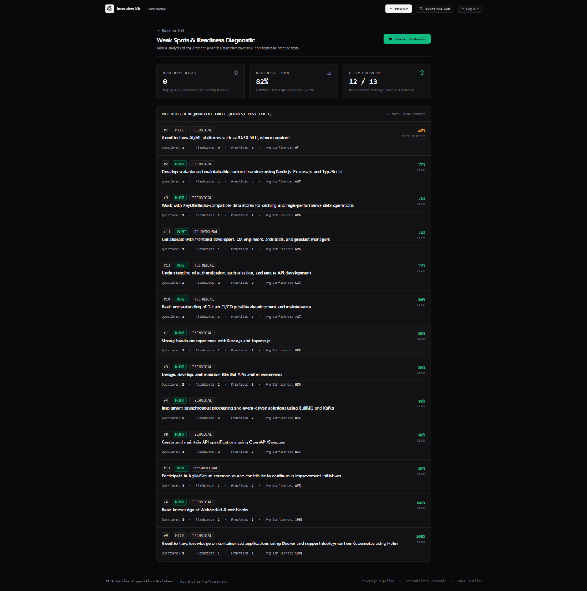

# AI Interview Preparation Kit

Turn a job description and company URL into a researched, editable interview preparation kit with role-specific questions, flashcards, weak-spot tracking, and a deterministic study plan.

Built for the Trao Full-Stack Engineering Assessment.

[](docs/RUBRIC_MAP.md)
[](tsconfig.base.json)
[](docs/ARCHITECTURE.md)
[](docs/SECURITY.md)
[](docs/DEMO_SCRIPT.md)

---

## Demo

| Resource          | Link                                                           |
| ----------------- | -------------------------------------------------------------- |
| Live Application  | https://ai-interview-preparation-assistant-ebon.vercel.app/    |
| API Health        | https://ai-interview-preparation-api.onrender.com/health       |
| Demo Video        | https://www.loom.com/share/3b3cb5108bcc49638187acc290da2389    |
| GitHub Repository | https://github.com/ravin972/ai-interview-preparation-assistant |

Production deployment: Next.js frontend on Vercel, Express API + worker on Render, MongoDB Atlas for durable state.

---

## Production Demo

The production walkthrough demonstrates:

- authentication
- job-kit creation
- 16-stage generation pipeline
- live progress via SSE
- evidence-backed requirements
- categorized interview questions
- flashcards
- deterministic study schedule
- practice mode
- weak-spot tracking
- export
- public web research through the SearchProvider/Tavily boundary

Demo:
https://www.loom.com/share/3b3cb5108bcc49638187acc290da2389

---

## Screenshots

### Landing page



### Generated interview kit



### Practice mode



### Dashboard



---

## Why this project

- **Semantic vs. deterministic boundary**: The LLM handles semantic generation; deterministic application code handles invariants, coverage verification, schedule allocation, integer minutes, and schema validation.
- **Durable MongoDB-backed jobs**: Generation state is persisted in MongoDB with atomic lease claims, heartbeats, and per-stage checkpoints; jobs survive server restarts and redeploys without stranding kits.
- **SSE as observability, not source of truth**: Server-Sent Events stream live stage-by-stage progress to the browser as a projected view; reconnecting clients replay state directly from MongoDB.
- **Defensive retrieval**: An SSRF-safe fetcher, custom DNS resolution hook, robots.txt compliance, and strict HTML sanitization protect against hostile input and prompt injection.
- **Framework-independent `packages/core`**: Domain logic, extraction guards, and the 16-stage pipeline contain zero database or HTTP framework dependencies, allowing identical execution by the Express API and the standalone offline evaluator.
- **Resilient model orchestration**: Google Gemini primary with Groq bounded fallback, schema-aware repair, backoff, and strict Zod output validation.

---

## What it does

A user pastes a job description, gives a company URL, and says how many days
they have. The system then:

1. extracts **atomic, evidence-backed requirements** from the job description;
2. researches the company by crawling its site and locating about, careers and
   hiring pages;
3. generates a company brief, categorised questions and flashcards;
4. runs a **deterministic coverage check** and generates questions for anything
   a must-have requirement still lacks;
5. builds a **deterministic study schedule** containing exactly the requested
   number of days;
6. lets the user edit, reorder, pin, delete and regenerate any section without
   losing their own work;
7. supports flashcard practice with confidence tracking, and reports which
   requirements they are weakest on.

Two principles run through the whole design:

- **The LLM does semantic work only.** Coverage comparison, schedule
  allocation, id assignment, integer minutes and schema validation are
  application code. See [docs/PIPELINE.md](docs/PIPELINE.md) section 3.
- **Missing research is recorded, not invented.** A two-line job description
  produces a thin, honest kit. A site that cannot be reached produces a
  documented gap, not a fabricated brief.

---

## Architecture summary

```
  Browser
    |  same-origin /api/*  (session cookie stays first-party)
    v
  apps/web     Next.js + Tailwind        -> Vercel
    |  server-side rewrite
    v
  apps/api     Node + Express            -> Render
    |     \
    |      \--- MongoDB Atlas   (users, sessions, kits, jobs, cardStats)
    v
  packages/core    runPipeline() + all domain logic
    ^              no Express, no MongoDB, no persistence
    |
  tools/evaluate   npm run evaluate  (no DB, no auth, no server)
```

Next.js handles the authenticated UI and same-origin `/api/*` proxy. Express owns authentication, kit APIs and job submission. MongoDB is the durable source of truth for users, sessions, kits and jobs. A worker executes the pipeline asynchronously. SSE is a projected progress channel; reconnecting clients recover authoritative state from MongoDB. `packages/core` remains framework-independent and is shared by the API and offline evaluator.

`packages/core` is the source of truth for requirement extraction, retrieval,
research sequencing, LLM orchestration, coverage, scheduling,
merge/regeneration, schema validation and pipeline execution. Both the API and
the batch evaluator call the same `runPipeline()`. Persistence lives outside
core, which is why the evaluator runs on a clean clone with no database.

Full detail: [docs/ARCHITECTURE.md](docs/ARCHITECTURE.md).

---

## Stack

| Layer                    | Choice                                                            | Notes                                                                 |
| ------------------------ | ----------------------------------------------------------------- | --------------------------------------------------------------------- |
| Frontend                 | Next.js (App Router) + Tailwind CSS                               | deployed on Vercel                                                    |
| Backend                  | Node 22 + Express                                                 | deployed on Render; long-lived process for SSE                        |
| Database                 | MongoDB Atlas, official `mongodb` driver                          | Zod is the single schema source, so no Mongoose - D-007               |
| Language                 | TypeScript, strict                                                | in every workspace                                                    |
| Validation               | Zod                                                               | every LLM output and the full kit structure                           |
| Retrieval                | `undici` + `cheerio` + `robots-parser`                            | static HTML only - D-020                                              |
| Search / public research | Tavily via direct HTTP fetch, behind `SearchProvider` abstraction | optional, bounded timeout, degrades to `no_public_discussion` - D-017 |
| Auth                     | `scrypt` from `node:crypto`                                       | no native build to fail on a free tier - D-018                        |
| Tests                    | Vitest                                                            | plus an offline evaluator run in CI                                   |
| CI                       | GitHub Actions                                                    | typecheck, tests, offline evaluator                                   |

No deviation from the assessment's preferred stack. The two choices that differ
from a default setup - the raw MongoDB driver rather than Mongoose, and no SDK
for the LLM providers - are recorded with their reasoning in
[docs/DECISIONS.md](docs/DECISIONS.md).

---

## LLM & search providers

| Role              | Provider             | Model / Implementation                 | Notes                                                              |
| ----------------- | -------------------- | -------------------------------------- | ------------------------------------------------------------------ |
| Primary LLM       | Google Gemini        | `gemini-2.5-flash`                     | primary structured generation                                      |
| Fallback LLM      | Groq                 | `openai/gpt-oss-120b`                  | bounded failover on 429, 5xx, or timeout                           |
| Test / CI LLM     | Built-in mock        | deterministic, offline                 | 100% offline test suite & evaluator                                |
| Public Research   | Tavily               | Direct HTTP fetch via `SearchProvider` | active when `TAVILY_API_KEY` is configured in backend environment  |
| Fallback Research | `NoopSearchProvider` | deterministic null provider            | used when key is absent, in evaluator/mock mode, or on API failure |

The LLM abstraction is deliberately small: one `LlmAdapter.complete()` interface,
three adapters, and one `generateStructured(task, schema)` router that owns all
parsing, validation, repair and failover.

```
Gemini -> parse -> Zod validate -> ok
             |            |
             |            +-- invalid -> one repair attempt
             |
             +-- 429 / 5xx / timeout -> bounded backoff -> Groq
```

Worst case is bounded at 2 adapters x 2 attempts per task. There are no
infinite repair loops, and every final output is Zod-validated.

Public web research is isolated behind SearchProvider. Tavily failures, timeouts, rate limits, malformed responses, or missing configuration degrade Stage 9 to `no_public_discussion` rather than failing the complete pipeline.

---

## Batch evaluator

```bash
npm run evaluate -- --input <cases.json> --output <kits.json>
```

Runs the same `runPipeline()` as the application. No MongoDB, no auth, no
server. Each case is isolated, so one failure never aborts the run. For a fully
offline, deterministic run:

```bash
LLM_PROVIDER=mock npm run evaluate -- --input fixtures/cases.json --output kits.json
```

Contract, input and output shapes, and the localhost fixture strategy:
[docs/EVALUATOR.md](docs/EVALUATOR.md).

---

## Setup & Local Deployment

### 1. Prerequisites

- Node.js >= 22
- Docker Engine >= 24 & Docker Compose >= 2.20

### 2. Quickstart with Docker Compose (Reproducible Full Stack)

```bash
git clone <repo> && cd "AI Interview Preparation Assistant"
cp .env.example .env

# Start MongoDB Replica Set, Express API, Standalone Job Worker, and Next.js Web
docker compose up -d

# Verify all services are healthy
docker compose ps
curl http://localhost:4000/health/ready
```

- **Web UI**: [http://localhost:3000](http://localhost:3000) (configurable via `WEB_PORT` if 3000 is occupied, e.g. `WEB_PORT=3001`)
- **Express API**: [http://localhost:4000](http://localhost:4000)
- **MongoDB Replica Set**: `mongodb://localhost:27017/interview_kit?replicaSet=rs0`

### 3. MongoDB Replica Set Invariant

The system strictly requires MongoDB transactions (`MONGODB_TRANSACTIONS_REQUIRED`) to guarantee multi-document atomicity for Kit and Job creation. Docker Compose provides a deterministic single-node replica set for transaction support in local/containerized environments. (This single-node topology provides transactional capability for local reproducibility, not high availability). Standalone non-transactional fallbacks are permanently disabled.

### 4. Verification & Testing

```bash
# Run all 760 Vitest tests (100% offline & deterministic via mock provider)
npm test

# Static typechecking and code style
npm run typecheck
npm run format:check

# Production Next.js build
npm run build

# Run deterministic batch evaluator across the 5 committed test fixtures
LLM_PROVIDER=mock npm run evaluate -- --input fixtures/cases.json --output kits.json

# Run end-to-end clean-clone smoke test against running Docker stack
npx tsx tools/docker-smoke.ts
```

### 5. Shutdown & Reset

```bash
docker compose down -v
```

---

## Deployment targets

| Component  | Target                    | Production URL / Details                                    | Notes                                                                   |
| ---------- | ------------------------- | ----------------------------------------------------------- | ----------------------------------------------------------------------- |
| `apps/web` | Vercel                    | https://ai-interview-preparation-assistant-ebon.vercel.app/ | proxies `/api/*` to the API so cookies stay first-party                 |
| `apps/api` | Render (free web service) | https://ai-interview-preparation-api.onrender.com/          | long-lived process + worker; idles after inactivity (30-50s cold start) |
| Health     | Render endpoint           | https://ai-interview-preparation-api.onrender.com/health    | lightweight HTTP liveness check; returns 200 `{ status: "ok" }`         |
| Database   | MongoDB Atlas M0          | Managed replica set                                         | provides durable multi-document transactions                            |
| CI         | GitHub Actions            | Automated pipeline                                          | typecheck + tests + offline evaluator on every push                     |

Render uses `/health` as a lightweight liveness endpoint. It does not require authentication or query external providers.

Because Render restarts the process on deploy and after idling, generation job
state is durable in MongoDB with a lease, a heartbeat and per-stage
checkpoints. SSE is the live progress mechanism but never the source of truth,
so a restart mid-generation resumes rather than stranding the kit. See
[docs/STATE_MODEL.md](docs/STATE_MODEL.md).

---

## Documentation

| Document                                     | Covers                                                                                 |
| -------------------------------------------- | -------------------------------------------------------------------------------------- |
| [docs/ARCHITECTURE.md](docs/ARCHITECTURE.md) | system diagram, package boundaries, persistence boundary, deployment                   |
| [docs/PIPELINE.md](docs/PIPELINE.md)         | all 16 stages, determinism boundary, extraction, coverage, schedule, failure matrix    |
| [docs/STATE_MODEL.md](docs/STATE_MODEL.md)   | kit states, job lease and checkpoints, item metadata, regeneration rules, concurrency  |
| [docs/SECURITY.md](docs/SECURITY.md)         | SSRF threat model, crawler citizenship, prompt injection, auth, authorization, secrets |
| [docs/EVALUATOR.md](docs/EVALUATOR.md)       | the batch command contract, offline mode, failure isolation, fixtures                  |
| [docs/RUBRIC_MAP.md](docs/RUBRIC_MAP.md)     | every rubric item mapped to module, test, UI evidence and acceptance criteria          |
| [docs/DECISIONS.md](docs/DECISIONS.md)       | 27 decision records with costs and rejected alternatives                               |
| [docs/DEMO_SCRIPT.md](docs/DEMO_SCRIPT.md)   | 60–90s recording script, shot-by-shot timeline, captions, voiceover                    |

---

## Implementation history

The implementation was executed in planned milestone phases across the automated and interactive rubric requirements, resulting in a fully tested, containerised system with 760 automated tests (46 test files, 0 failures, 3 skipped):

**Automated evaluation foundation (~8h)**

| Phase | Work                                                                       |
| ----- | -------------------------------------------------------------------------- |
| 0     | toolchain, Vitest, CI, fixture site and fixture JDs                        |
| 1     | kit schema, invariants, id allocator, **coverage**, **schedule** + tests   |
| 2     | LLM adapters and router, **requirement extraction and its guards** + tests |

**Pipeline, evaluator & API (~8h)**

| Phase | Work                                                                             |
| ----- | -------------------------------------------------------------------------------- |
| 3     | retrieval: SSRF, robots, fetch, crawl, rank, extract, sanitize + security tests  |
| 4     | 16-stage orchestrator, checkpoints, **`npm run evaluate`** + offline CI run      |
| 5     | MongoDB, auth, kits, job lease and sweeper, SSE, merge engine, practice, reports |

**Interactive experience, hardening & containerization (~7h)**

| Phase | Work                                                                               |
| ----- | ---------------------------------------------------------------------------------- |
| 6     | UI: auth, kit list, create and batch, live progress, builder, practice, weak spots |
| 6.5   | Adversarial security & concurrency audit (TOCTOU optimistic lock, scope locking)   |
| 7     | Docker multi-container stack, replica set automation, reproducible clean checkout  |

---

## Known limitations

Stated up front rather than left for a reviewer to discover:

- **JavaScript-only sites** yield a thin company brief and a recorded research
  gap. The crawler reads static HTML and does not run a headless browser
  (D-020).
- **A paraphrased deleted item can return.** Deletion tombstones match on a
  normalized text fingerprint, so an exact or near-exact regeneration is
  blocked but a genuine rewording is not (D-015).
- **Public interview discussion uses Tavily when `TAVILY_API_KEY` is configured.** Search
  results are treated as untrusted external data and failures degrade Stage 9 to
  `no_public_discussion`. Search-engine result pages are not scraped.
- **Render free-tier cold start** adds roughly 30-50 seconds to the first
  request after idling.
- **Single API instance assumed.** The job lease is written to be correct under
  concurrent claims, but horizontal scaling is untested.
